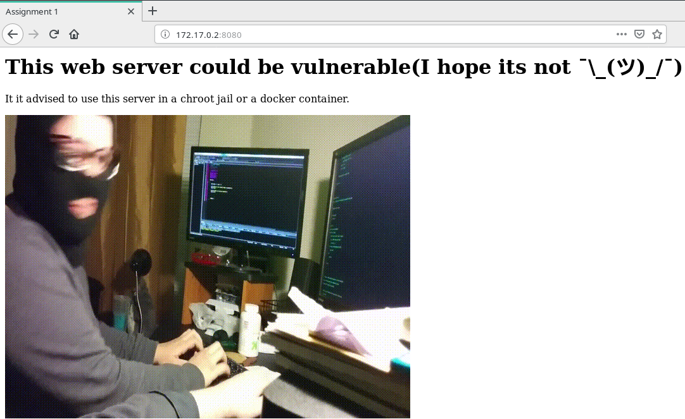

# Assignment 1 - chroot

[](https://forthebadge.com)
[](https://forthebadge.com)
[](https://forthebadge.com)
[](https://forthebadge.com)
## Task

Write a program to run python or bash file in chroot jail securely.

* Create a new chroot jail
* Check chroot successes or not
* Run a bash or python script in the chroot jail

## Information

* Languages:
  *  `assignment1` written in Golang **1.11.5**
  *  `initializer.sh` written in Bash **5.0.0**
*  Tested on **Ubuntu 16.04**
* Shipped with Docker **18.09.2-ce**
* **ROOT** power is required!

The **`assignment1`** binary is a statically compiled simple web server that tries to serve an index.html on `0.0.0.0:8080` address but the assignment1 binary will **NOT** work if its jailcheck test fails.

The **`initializer.sh`** script is used for putting **assignment1** binary into a **chroot jail**.

## Instructions

* Clone this repository to your computer
    - `git clone https://github.com/nsa/ceng2034_os_labs`

* Change working directory into the folder **assignment1**
    - `cd assignment1`

### Run with Docker(recommended)

* Build Docker image from the Dockerfile
    - `docker build -t os_assignment1 .`

* Run it in a container
    - `docker run -it --rm -p 8080:8080 os_assignment1`

### Run without Docker
* (Optional) Build **`assignment1.go`**
    - `go build` 

* Run **`initializer.sh`**
    - `sudo bash initializer.sh`

## Expected result

```
Looks like we're in a jail
WEB SERVER STARTING
Serving on: http://172.17.0.2:8080
```

After seeing an output like above go to these addresses that are written in the output. In my case there is only one address and it is http://172.17.0.2:8080.

Then, you should see the index page on your browser.
