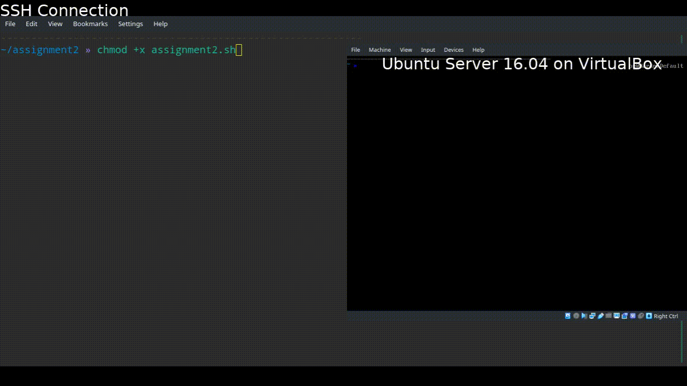

# Assignment 2 - boot

## Task

* Read your MBR and write it into a file
* Enter a new entry in GRUB with an iso under your home directory
* Bonus points: Run the new operating system on GRUB entirely on the ram

## Information

This script reads MBR command and write it into a file called `mbr.bin` with **dd** command. Then it prints the **hex** of `mbr.bin` file with **hexdump** command.

After that, it creates a new GRUB entry for *archlinux-2019.02.01-x86_64.iso* file.

## Instructions
* Download **archlinux-2019.02.01-x86_64.iso** file from [here](https://www.archlinux.org/releng/releases/2019.02.01/)
	- Move this file to `/assignment2/arch.iso`
	- Since my home folder is encrypted it needed to be somewhere else from `/home` folder.

* Clone this repository to your computer
    - `git clone https://github.com/nsa/ceng2034_os_labs`

* Change working directory into the folder **assignment2**
    - `cd assignment2`

* Change disk partitions and file system UUID from **menu_entry** file according to your disk partitions.

* Give execute permission to the **assignment2.sh**
    - `chmod +x assignment2.sh`

* Run the script as root
	- `sudo su`
	- `./assignment2.sh`

## Expected result

